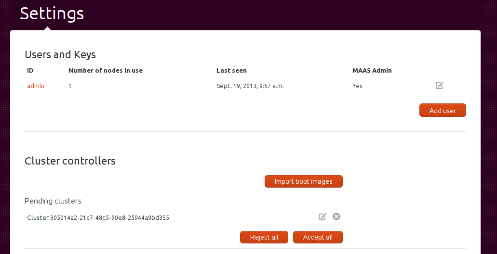
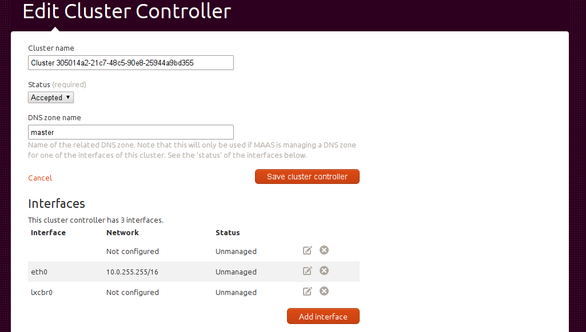
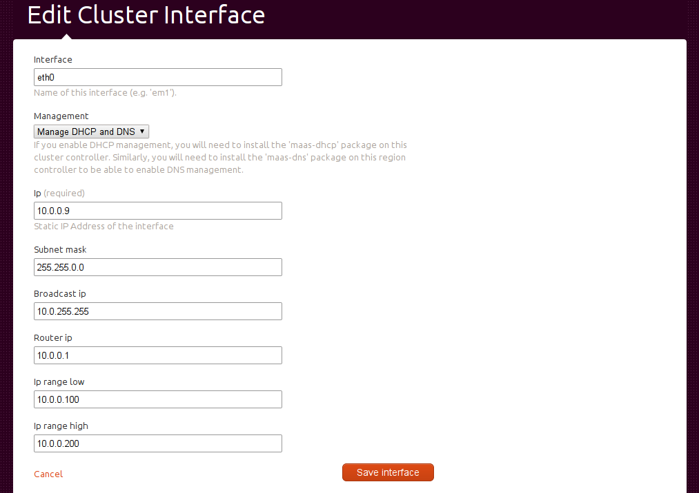

Cluster Configuration
=====================

Before all the features of MAAS can be used for the first time, you have to
accept and configure a cluster controller.  If you don't do this step, you
will have to look at :ref:`manual-dhcp`.

Cluster acceptance
------------------

For each new cluster that is added to MAAS, including the initial installation,
it has to be first accepted into the system.  Clusters that are installed but
have not been accepted yet show up as "pending".  The exception to this is that
the very first cluster controller to connect from the same host as the region
controller is automatically accepted.

Click on the settings "cog" icon at the top right to visit the settings page:

You can either click on "Accept all" or click on the edit icon to edit
the cluster.  After clicking on the edit icon, you will see this page:

Here you can change the cluster's name as it appears in the UI, the DNS
zone and its status if you didn't use the "Accept all" button on the
previous page.

Now that the cluster controller is accepted, you can configure one of its
interfaces to be managed by MAAS (managing multiple cluster controller
interfaces is not available in MAAS just yet).

Cluster interface management
----------------------------

In the example here, we will click on the edit icon for ``eth0``, which
takes us to the next page:

Here you can set what type of management you want:

#. DHCP only - this will run a DHCP server on your cluster
#. DHCP and DNS - this will run a DHCP server on the cluster *and* configure
   the MAAS DNS server's zone file with the correct details to look up nodes
   in this cluster by their names.

.. note::
 You cannot have DNS management without DHCP management because MAAS relies on
 its own DHCP server's leases file to work out the IP address of nodes in the
 cluster.

If you set the interface to be managed, you now need to provide all of the
usual DHCP details in the input fields below.  Once done, click "Save
interface" and a new dhcp config will be written to the cluster and that
cluster controller will now be able to boot nodes.
