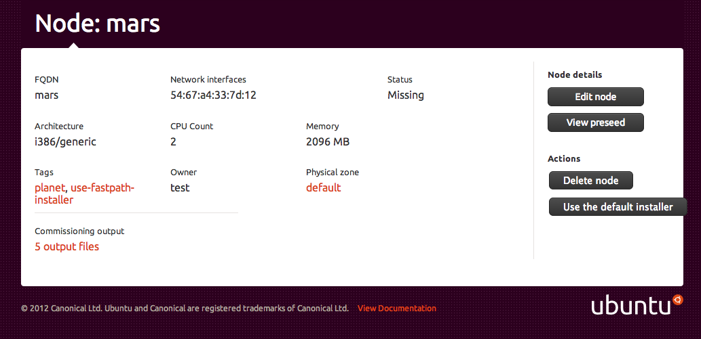

=====================================
Installing Ubuntu and deploying nodes
=====================================

Once a node has been accepted into MAAS and is ready for use, users can
deploy services to that node.

Prior to deployment, MAAS is responsible for:

1. Powering up the node.
2. Installing Ubuntu on the node.
3. Installing the user's SSH keys on the node.

Once these steps have been completed, the node is ready to have services
deployed to it, either manually or by using a tool like Juju_.

There are two ways to install Ubuntu on a node:

1. :ref:`The Debian installer <debian-installer>`.
2. :ref:`The fast installer <fast-installer>`.

.. _Juju: http://juju.ubuntu.com

.. _debian-installer:

The Debian Installer
----------------------

The Debian Installer installs Ubuntu on a node in exactly the same way
as you would install it manually: using the `Debian Installer`_.
Answers to the questions asked by the installer are provided in a 'preseed'
file. For more information on preseed files, see the :ref:`Additional
Configuration <preseed>` page.

The Debian installer is not enabled by default.  To enable it for a node that's
been configured to use the fast installer, visit the node's page as an
administrator and click the ``Use the Debian installer`` button.

To set multiple nodes to use the Debian installer, select the ``Mark
nodes as using the Debian installer`` option from the bulk action menu
on the ``Nodes`` page in the MAAS web UI.

Because it installs Ubuntu from scratch, downloading packages as
required, the Debian installer is slower than the :ref:`fast installer
<fast-installer>`.

.. _Debian Installer: http://www.debian.org/devel/debian-installer/

.. _fast-installer:

The fast installer
------------------

The fast installer is, as the name suggests, a means of installing
Ubuntu on a node more quickly than would be possible using the
:ref:`Debian installer <debian-installer>`.

The fast installer is enabled by default for newly enlisted nodes.

.. image:: media/node-page-use-fast-installer.png

To set multiple nodes to use the fast installer, select the ``Mark nodes
as using the fast installer`` option from the bulk action menu on the
``Nodes`` page in the MAAS web UI.

The fast installer copies a pre-built Ubuntu image to the node, with all
the packages installed that would be normally found in an Ubuntu
installation.

The fast installer is much quicker than the Debian installer, but has
the disadvantage that it's less easy to configure a node at install
time, since the fast installer doesn't use a :ref:`preseed file
<preseed>`. In addition, the packages that are initially installed on a
fast-installed node need updating manually, since they are part of the
installation image and not downloaded fresh from an apt repository.

For more information about the fast installer, see the `curtin project`_
on Launchpad.

.. _curtin project: https://launchpad.net/curtin
