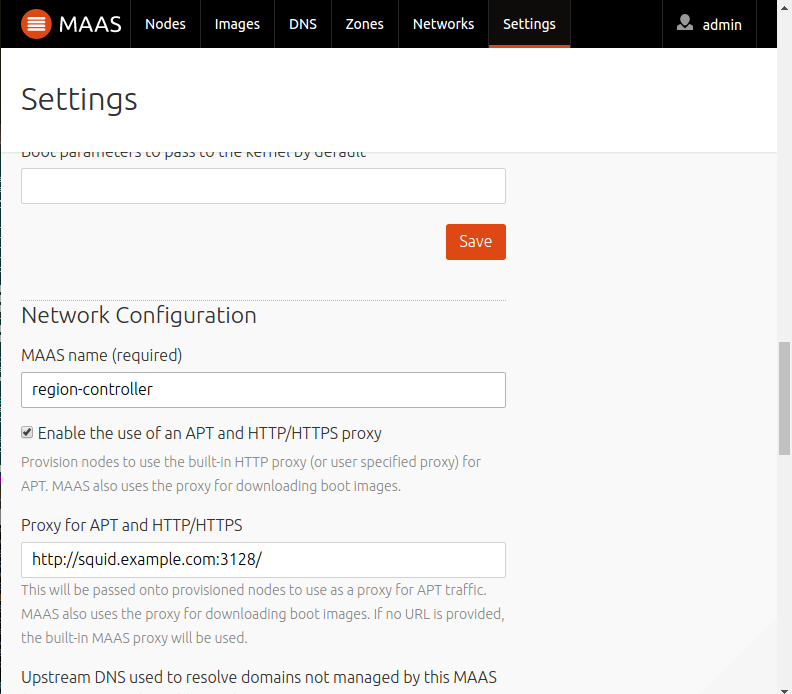
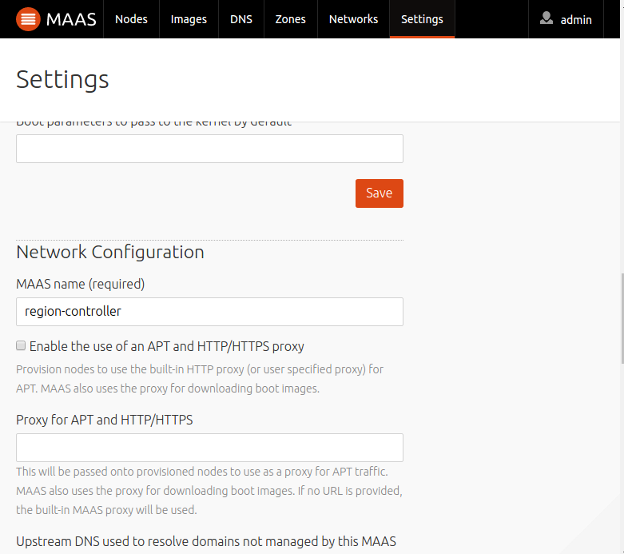

.. -*- mode: rst -*-

.. _maas-proxy:

Proxy Configuration
===================

In most cases, the machines deployed in a MAAS installation will use a proxy to
access the archive.  Alternatively, MAAS can be told to use an externall
configured proxy, or none at all.

As of MAAS 2.0, the default MAAS region controller configuration will create a
maas-proxy configuration that explicitly allows all of the subnets in the
configuration to use it for a proxy.

Assumptions
-----------

It is generally assumed that the MAAS region controller is not exposed to
untusted networks.  (That is, that there is a firewall between the MAAS region
controller and any such networks.)  Prior to MAAS 2.0, the only option if this
was not the case was to manually edit /etc/maas/maas-proxy.conf, or use
iptables to create a firewall on the host.

As of MAAS 2.0, permission to use the proxy can be managed on a per-subnet
basis. (The default is to allow proxying.)

.. warning:: If your MAAS Region is connected to an untrusted network, you should disable that subnet in the proxy, as shown below.

MAAS Proxy Installation
-----------------------

When you install a Region Controller, maas-proxy will be installed.  The
configuration of the proxy relies on maas-proxy being on the same machine as
the Region Controller.

Using an external proxy
-----------------------
If you want to use an external proxy, see the Network Configuration section of
the web user interface to set the proxy url.

Alternatively, the following
command will specify squid.example.com as the proxy, using port 3128::

 $ maas admin maas set-config name=http_proxy value=http://squid.example.com:3128/

Disable proxying for a Subnet
-----------------------------
As an example, we will configure MAAS to disable the proxy for a subnet::

 $ maas admin subnet update 192.168.0.0/22 allow_proxy=False

Enable proxying for a Subnet
----------------------------
To re-enable the proxy for that subnet::

 $ maas admin subnet update 192.168.0.0/22 allow_proxy=True

Allow an arbitrary subnet to use the Proxy
------------------------------------------
Since the default is to allow proxying, simply create the subnet in MAAS::

 $ maas admin subnets create cidr=192.168.100.0/23

You may wish to set other parameters on the subnet.

Disabling proxying
------------------
If you want to not use any proxy, see the Network Configuration section of
the web user interface and uncheck the "Enable the use of an APT and HTTP/HTTPS
proxy" box.

Alternatively, the following command will disable the proxy::

 $ maas admin maas set-config name=enable_http_proxy value=False
