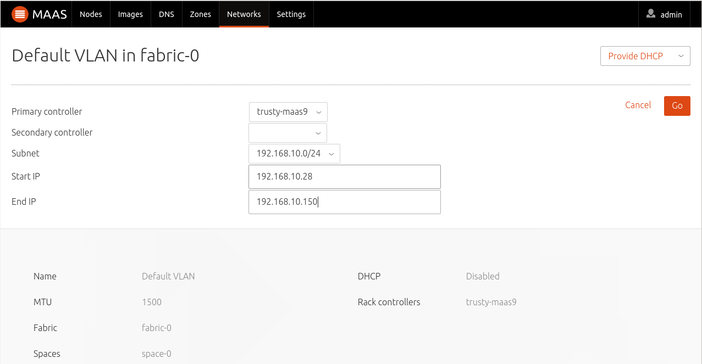

.. -*- mode: rst -*-

.. _rack-configuration:

Rack Controller Configuration
=============================

Before any of MAAS's features can be used for the first time, you must have
a Rack Controller and configure at least one VLAN to manage DHCP for at least
a subnet. Each machine can be attached to any number of subnets, which may or
may not be managed by MAAS.

Managing a VLAN normally means that MAAS will server DHCP from the Rack
Controller, for the purpose of providing IP address to machines that
are being enlisted or commissioned. also, any other DHCP client that is
on the VLAN will obtain a dynamic IP address from the MAAS DHCP server.

**Do this only on a network that was set up with this in mind**. Enabling
your own DHCP server that competes with an existing one that's
being managed by MAAS can cause serious disruption, and it can be hard
for administrator to track the source of the problem.  Worse, the problems
may not become immediately noticeable.  Make sure you understand the
implications of running a DHCP server before doing this.  If MAAS detects any
DHCP servers already running on these networks, it will show them on the
rack's configuration page.

Network requirements
--------------------

The Rack Controller manages DHCP for subnet(s) in the VLAN(s) that it is
connected to via one of its interfaces defined in MAAS. Rack Controller
interfaces are discovered automatically, when MAAS is installed, and any
future changes are automatically communicated to the region.

When a Rack Controller manages machines on the network through one of the
VLANs it is connected to, the machines must be in the same subnet as the
Rack Controller interface connected to that VLAN. This is because:

#. If the VLAN that the Rack Controller is connected to is configured to
   provide DHCP, the nodes must be able to configure their own network
   interfaces using MAAS's DHCP server. This means that either they must
   be on the same subnet, or that DHCP packets are being specially routed
   between the machine's subnet and MAAS' DHCP server.

Rack Controller Registration
----------------------------

If you install your first Rack Controller on the same system as the Region
Controller, as is the case when you install the full "maas" ubuntu package,
it will be automatically accepted by default (but not yet configured, see
below).  Any other Rack Controllers you set up will show up automatically
after they have been manually added to MAAS.

To install a new MAAS Rack Controller, at the command line, type::

 $ sudo apt-get install maas-rack-controller

Once installed, you will need to input the shared secret, in order
to allow the Rack Controller to authenticate with the Region Controller.
You can obtain the shared secret from the Region Controller. The
shared secret can be copied from the Region Controller in::

 /var/lib/maas/secret

Once you have copied the secret, you can install it in the Rack
Controller. At the command line, type::

 $ sudo maas-rack install-shared-secret

Once installed, you will need to reconfigure the Rack Controller
to correctly point to the API hostname or IP address of the Region
Controller that's on the same network as the Rack Controller::

 $ sudo dpkg-reconfigure maas-rack-controller

The configuration for the MAAS Rack Controller will automatically
run and pop up this config screen:

.. image:: media/install_cluster-config.*

This is where the MAAS Rack Controller is prompting for the URL
of the MAAS Region Controller. Once entered, the Rack Controller
configuration will be complete.

Rack Controller Interface Management
------------------------------------

MAAS automatically recognises the network interfaces on each Rack
Controller.  Some (though not necessarily all) of these will be connected
to subnets on a VLAN inside a Fabric. In other words, the Rack Controllers
will be connected to VLANs, and the subnets being served on these.

Once a new Rack Controller is connected, it will try to autodetect in
what Subnet, VLAN and even Fabric the interface is connected to. If these
have not being created, new Subnets, VLAN's and Fabrics and Spaces will
be created.

If Fabrics, VLANs and Subnets are already created, once MAAS automatically
recognises the Rack Controller network interfaces, it will try to determine
to which these are connected to before being able to provide services.

As such, each Rack Controller interface will determine whether a Rack
Controller can provide DHCP on an specific VLAN, or for advanced configuration,
a Rack Controller interface will determine whether a Rack Controller
can be a primary or backup Rack on an HA configuration.

If for any reason, the Rack Controller interfaces are mis-identified
and are in the correct fabric, the user can manually change that by
editing the Rack Controller Fabric information:

.. image:: media/rack-interface-edit.png

In order for MAAS to be able to manage a machine throught its lifecycle,
it needs to provide DHCP for at least one subnet, by configuring the
corresponding VLAN to which the Rack Controller is connected to.

Providing DHCP Services
-----------------------
In order for MAAS to be able to manage machines on the network, and more
specifically, in order to be able to enlist, commission and deploy machines
it needs to provide and manage DHCP. As such, Rack Controller(s) can
provide DHCP on the different VLANs it is connected to.

Dynamic range & addresses
^^^^^^^^^^^^^^^^^^^^^^^^^
Starting from MAAS 2.0, a Dynamic range needs to be defined in order for
MAAS to be able to provide DHCP for machines. The purpose of the dynamic
range is to:

 * provide DHCP for machines that are performing auto-registration (also
   called enlistment), or
 * provide DHCP for machines that are being commissioned.

 This means that when a machine is being enlisted or commissioned, they
 DHCP from the dynamic range in order to perform those two steps.

 In turn, however, machines that are being deployed will, by default,
 obtain static IP addresses (DHCP or otherwise) from the section of the
 subnet that has not been reserved for the Dynamic Range on such VLAN.
 This allows the machine to obtain IP addresses that will remain
 allocated to a machine throughout the rest of its deployment.

Enabling a Rack Controller to provide DHCP on a VLAN
^^^^^^^^^^^^^^^^^^^^^^^^^^^^^^^^^^^^^^^^^^^^^^^^^^^^
As an example, we will configure MAAS to provide DHCP on a Rack
Controller.

The first thing that we need to do is select in what VLAN and subnet
we would like to configure DHCP. In this case, in order to be able
to PXE boot machines, we need to configure DHCP for an 'untagged' VLAN
under any fabric. In this example, we will chose the 'untagged' VLAN on
'fabric-0'. The subnet '192.168.10.0/24' is on this 'untagged' VLAN. We
can see that the Rack Controller has access to this VLAN via its 'eth0'
interface.

The second step is to create a dynamic range::

 $ maas admin ipranges create type=dynamic start_ip=192.168.10.28 end_ip=192.168.10.100

The third, and last step is to enable DHCP on a VLAN. For this to be
effective we need to at least select the Primary Rack controller that will
provide DHCP. We can select a Secondary Rack controller if we are providing
HA::

 $ maas admin vlan update fabric-0 untagged dhcp_on=True primary_rack=node01

You can also do the same configuration via the WebUI on the VLAN details page:

Note that if you are enabling DHCP over the CLI, the subnet doesn't have a
Gateway IP defined, you can do so with::

 $ maas admin subnet update 192.168.10.0/24 gateway_ip=192.168.10.1

Multiple networks
-----------------

A single Rack Controller can be connected to more than one VLAN, each from a
different Rack Controller interface.  This allows one Rack Controller to
manage different subnets to help scale your Rack Controller or to satisfy
your network architecture.
